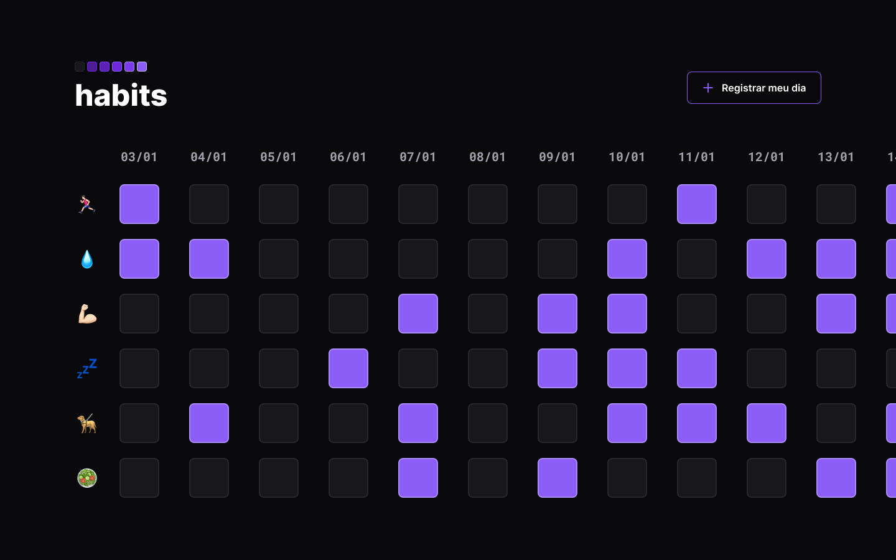

<h1 align="center"> Habits </h1>

NLW-SETUP App para guardar tarefas do dia a dia  

    <a href="#-tecnologias">Tecnologias</a>&nbsp;&nbsp;&nbsp;|&nbsp;&nbsp;&nbsp;
    <a href="#-projeto">Projeto</a>&nbsp;&nbsp;&nbsp;|&nbsp;&nbsp;&nbsp;
    <a href="#-layout">Layout</a>&nbsp;&nbsp;&nbsp;|&nbsp;&nbsp;&nbsp;
    <a href="#memo-licença">Licença</a>

    <im alt="Licença" src="https://img.shields.io/static/vl?label-license&message=MIT&color=49AA26&labelColor=000000">

 

    

## Tecnologias

Esse projeto foi desenvolido com as seguintes tecnologias:

- HTML e CSS
- JavaScript
- Git e GitHub
- Figma

## Projeto

O Projeto Habits e um App para registrar os Habitos

- [Visite o projeto online](https://luanp618.github.io/NLW-Setup/)

## :memo: Licença

Esse projetoesta sob a licença MIT.